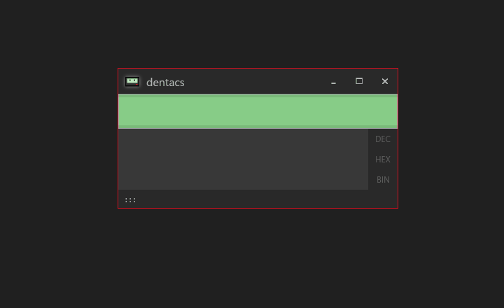

# dentacs

[](https://github.com/suconbu/dentacs/releases)
[](https://suconbu.visualstudio.com/dentacs/_build/latest?definitionId=2&branchName=master)

The dentacs is text-box based calculator for Windows Desktop.  
It's developing with WPF and C# .NET Framework 4.7.2.

Executable binaries are available:  
https://github.com/suconbu/dentacs/releases

Demo:  



Main features:  
* Multiline expression editor
* Can be mix different radix numbers in a expression
* Display calculation result in 3 different radix numbers at once
* Character code information (CodePoint, UTF-16, UTF-8) is displayed in status bar
* Operation for datetime / timespan -> [Datetime/Timespan](#Datetime/Timespan)

## Shortcut keys

Key               | Description
------------------|------------------------
Tab               | Toggle keypad
F11               | Toggle full-screen mode
Ctrl + MouseWheel | Zooming text
Ctrl + A          | Select all lines
Ctrl + Z          | Undo
Ctrl + Y          | Redo

## Numbers

Numbers can be integer and floating point, which are usually not distinct.  
(but bitwise operations can only use integers)  
The integer part can represent a signed 64-bit, and the fraction part in floating point can represent up to 16 digits.  

Numerical values can be expressed in follows.  
Only decimal numbers can have fraction part.  

Type        | Representation of '1234'
------------|-------------------
Decimal     | 1234, 1234.0
Hexadecimal | 0x04d2, 0x4D2
Octal       | 0o2322
Binary      | 0b0000010011010010

## Datetime/Timespan

Term     | Definition                         | Example
---------|------------------------------------|------------------
Datetime | Represents a point on the timeline | `'2001/4/1 00:00', '4/1'`
Timespan | Represents the length of time      | `'15:00', '9h300m'`

Supported operations:

Left hand side | Operation  | Right hand side | Result
---------------|------------|-----------------|-------
Datetime       | -          | Datetime        | Timespan
Datetime       | +/-        | Timespan        | Datetime
Timespan       | +/-        | Timespan        | Timespan

Example of use:
```py
'2000/4/1 12:00' - '1999/4/1 12:00'  # '366d 00:00:00'
'2000/4/1 12:00' + '15:00'           # '2000/04/02 03:00:00'
'4/1'   + '40day'                    # '2020/05/11 00:00:00' (In 2020)
'15:00' - '300min'                   # '10:00:00'
'3day'  - '10.5h'                    # '2d 13:30:00'
```

## Operators and precedence

The followings the supported operators in dentacs, from highest to lowest precedence.

Precedence | Operation           | Token | Examples
-----------|---------------------|-------|-------------------
1          | Exponentiation      | **    | 5 ** 3 -> 125
2          | Positive sign       | +     | +5     -> 5
2          | Negative sign       | -     | -5     -> -5
2          | Bitwise NOT         | ~     | ~5     -> -6 (~0b0101 -> 0b1111...1010)
3          | Multiplication      | *     | 5 * 3  -> 15
3          | Division            | /     | 5 / 3  -> 1.666...
3          | FloorDivision       | //    | 5 // 3 -> 1
3          | Reminder            | %     | 5 % 3  -> 2
4          | Addition            | +     | 5 + 3  -> 8
4          | Subtraction         | -     | 5 - 3  -> 2
5          | Bitwise left shift  | <<    | 5 << 3 -> 40 (0b0101 << 3 -> 0b00101000)
5          | Bitwise right shift | >>    | 5 >> 3 -> 0  (0b0101 >> 3 -> 0b0000)
6          | Bitwise AND         | &     | 5 & 3  -> 1 (0b0101 & 0b0011 -> 0b0001)
7          | Bitwise OR          | \|    | 5 \| 3 -> 7 (0b0101 \| 0b0011 -> 0b0111)
8          | Bitwise XOR         | ^     | 5 ^ 3  -> 6 (0b0101 ^ 0b0011 -> 0b0110)
9          | Assignment          | =     | x = 5 + 3 -> 8

## Variables

Variable can store calculated value temporary.  
When you delete the expression of assignment, the variable value also delete.  
Constants, functions and keywords cannot be used variable names.  

```py
x = 10     # x:10
y = x ** 2 # y:100

PI = 3  # Error: 'PI' is a constant
pi = 3  # OK: It is case sensitive
```

## Functions

Identifier | Parameters  | Description
-----------|-------------|-----------------------------------------------------------------
trunc      | (n)         | Returns the integer part of a number by removing any fractional
floor      | (n)         | Returns the largest integer less than or equal to a given number
ceil       | (n)         | Returns the number of rounded up to the next largest integer
round      | (n)         | Returns the value of a number rounded to the nearest integer
sin        | (d)         | Returns the sine of a number of degrees
cos        | (d)         | Returns the cosine of a number of degrees
tan        | (d)         | Returns the tangent of a number of degrees
asin       | (n)         | Returns the arcsine (in degrees) of a number
acos       | (n)         | Returns the arccosine (in degrees) of a number
atan       | (n)         | Returns the arctangent (in degrees) of a number
atan2      | (y, x)      | Returns the arctangent (in degrees) of a y and x (e.g. atan2(1, 1) -> 45)
log10      | (n)         | Returns the base 10 logarithm of a number
log2       | (n)         | Returns the base 2 logarithm of a number
log        | (n[, base]) | Returns the natural logarithms or logarithm of a number with specified base (e.g. log(9, 3) -> 2)

## Constants

Identifier | Description
-----------|----------------------------------------------------------------------
PI         | The ratio of the circumference of a circle to its diameter (3.141...)
E          | The base of natural logarithms (2.718...)

## Keywords

The following identifiers are reserved words and cannot be used as variable names.

```
if        elif      else      then      for
in        to        repeat    do        end
continue  break     exit      or        and
not
```

## Lisence

MIT License
